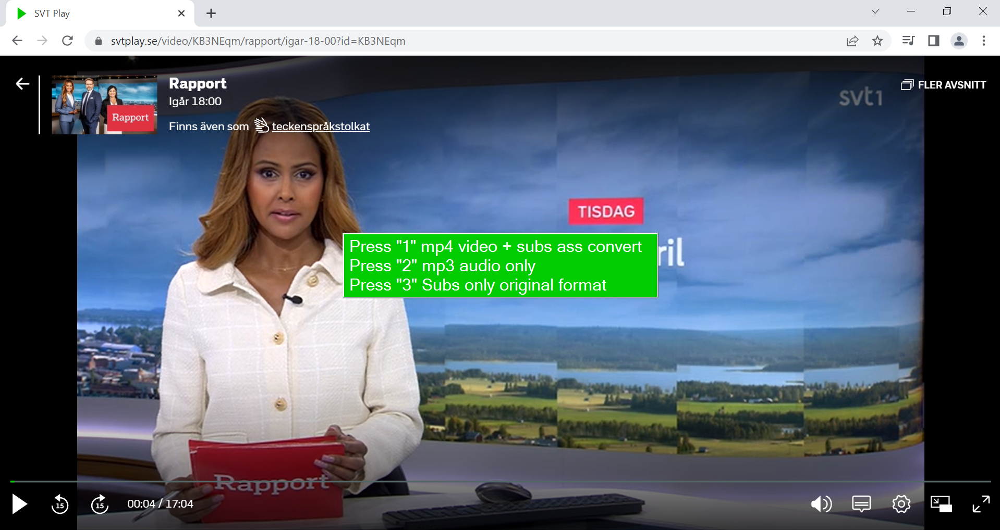

# yt-dlp-multiconfig
Browser utility for yt-dlp with multiple config files

yt-dlp-multiconfig is a utility to facilitate downloads in any browser with the popular  
yt-dlp program https://github.com/yt-dlp/yt-dlp

_**Features**_
 - _Should work with all browsers_
 - _3 different config options_
  - _Passes referer url to yt-dlp_
  
  **Instructions**  
Put yt-dlp-multiconfig.exe in a folder of your choice.  
First time you run it it will create a settings file called yt-dlp-multiconfig.ini in the same directory.  
Open that file with a texteditor and edit the path to yt-dlp.exe.   
A folder is also created called presets, where the 3 config files are located.  
It is higly recommended to add yt-dlp to the path variable [How to add path](https://www.architectryan.com/2018/03/17/add-to-the-path-on-windows-10/)  
It is also recommended to download ffmpeg and put in the same folder as yt-dlp.exe.

 
If you want to change the shortcut key **Ctrl + p** you can do that as well to start the download process.  
To exit the program press **F4**

The Preset options can be named anything reflecting what you put in the config files.  
If you change Debug to "on" yt-dlp will stay open for debugging purposes.  
For more thorough info add `--verbose` to the config file/s  

Example below:
```
[Options]
ProgramPath=yt-dlp
Preset1=mp4 video + subs ass convert
Preset2=mp3 audio only
Preset3=Subs only original format
Shortcut=p
Debug=off
```
The `-P` switch in the config files sets the download location for the videos/subtitles etc  
Download here: [yt-dlp-multiconfig-v1.0.zip](https://github.com/dobbelina/yt-dlp-multiconfig/releases/download/v1.0-Windows/yt-dlp-multiconfig-v1.0.zip)


(Windows only)  


## Screenshot

<p align="center"></p>

